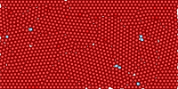

# Technical Report: Disjoint Set Union (DSU) for Particle Jamming Analysis

**Name:** Shao-Yu, Huang  
**Topic:** Disjoint Set Union with Path Compression and Union by Size in 
Granular Media

---

## 1. Introduction
### 1.1 Overview of the Data Structure
The Disjoint Set Union (DSU), commonly referred to as Union-Find, is an 
efficient data structure designed to manage the partitioning of a set into 
disjoint, non-overlapping subsets. It primarily facilitates two fundamental 
operations:
1. **Find**: Identifies the specific subset containing a given element, 
   typically by returning a representative member.
2. **Union**: Merges two distinct subsets into a single, unified set.

### 1.2 The Problem: Rigidity Percolation in Granular Media
Within the field of soft matter physics, identifying "force chains" in 
granular media—such as sand or soil—is critical for predicting structural 
failure or jamming transitions. This paper implements a DSU-based approach 
to analyze rigidity percolation: the threshold at which a collection of 
interacting particles forms a globally connected, rigid cluster that spans 
the system boundaries.



### 1.3 Brief History
The DSU was first described by Bernard A. Galler and Michael J. Fischer in 1964.
While the basic concept is intuitive, the highly optimized version 
using **Path Compression** and **Union by Rank/Size**—which results in 
nearly constant time complexity—was rigorously analyzed by Robert Tarjan in 
1975 using the inverse Ackermann function.

### 1.4 Report Roadmap
This report evaluates the theoretical efficiency of the DSU, provides an 
empirical analysis of its performance within a quasi-2D physics simulation, 
and details the specific C++ implementation strategies employed.

---

## 2. Analysis of the Data Structure
### 2.1 Theoretical Complexity
#### Core Concepts

* **Path Compression:** A technique where every node visited during a `find` 
  operation is attached directly to the root, shortening future paths.
// TODO
* 
* **Union-by-Rank:** A rule where the tree with the smaller height (rank) is 
  attached to the root of the tree with the larger height, ensuring the 
  maximum height is logarithmic.
* **The Proof Strategy:** The author uses "checklines" (horizontal 
  boundaries at specific ranks) to bound the number of "find-edges" created 
  during operations.
    * **Terminal Edges:** The last edge in a find-path ($\mathcal{O}(m)$ total).
    * **Non-terminal Edges:** Edges that are shortened by path compression. 
      These are bounded by how many checklines they "jump" over.

#### Progression of Bounds

The tutorial demonstrates how different distributions of checklines lead to 
increasingly tighter upper bounds:
1.  **Square-root Bound:** Using $\sqrt{h}$ checklines yields $\mathcal{O}(m 
+ n\sqrt{\log n})$.
2.  **Logarithmic Bound:** Using checklines at powers of 2 yields $\mathcal
    {O}((n+m) \log \log n)$.
3.  **Iterated Logarithm Bound:** Using a "power tower" distribution yields 
    $\mathcal{O}(m + n \log^* n)$.
4.  **Inverse Ackermann Bound:** By using the **Ackermann function** to 
    define checkline positions, the author proves the final complexity of 
    $\mathcal{O}((n + m) \alpha(n))$.

#### The Ackermann Function
The Ackermann function $A(i, j)$ represents a hierarchy of hyperoperations 
(addition, multiplication, exponentiation, tetration, etc.). Its inverse, 
$\alpha(n)$, grows incredibly slowly—remaining $\leq 5$ for any value 
representing physical quantities in the universe.

### 2.2 Space Complexity
The space complexity is strictly linear:
$$O(n)$$
where $n$ is the number of elements (particles). This is due to the 
requirement of two auxiliary arrays: `parent` and `size`.

---

## 3. Empirical Analysis
### 3.1 Experimental Design
The implementation was evaluated using a quasi-2D simulation environment 
under Periodic Boundary Conditions (PBCs). Our analysis characterizes the 
jamming transition by systematically varying the packing fraction ($\phi$), 
allowing for the identification of the critical threshold where rigid 
clusters emerge.

### 3.2 Data Observations
Experiments were conducted within a rectangular simulation box under hybrid 
boundary conditions. The system is constrained by hard walls at the top and 
bottom, which the particles cannot penetrate. In the horizontal direction, 
Periodic Boundary Conditions (PBCs) are applied; particles exiting the right 
boundary re-enter from the left, effectively simulating an infinitely 
repeating horizontal domain.

* **Dilute State ($\phi = 0.40$):** Max cluster size remained low (< 5% of 
  $n$). No spanning cluster detected.
* **Transition State ($\phi = 0.74$):** Large clusters began to form. DSU 
  detected a spanning cluster (Jammed). 0.74 is the packing fraction of 
  Hexagonal Packing, which is the most dense packing without overlapping.
* **High Density ($\phi = 0.84$):** This is the dense state mention in paper 
  https://academic.oup.com/comnet/article/6/4/485/4959635?login=false.


---

## 4. Application: Computational Physics
In granular materials, stress is not distributed uniformly; it travels along 
"force chains." By using the DSU, researchers can:
1.  Quantify the number of independent clusters in a system.
2.  Identify the "Strong Network" versus "Weak Network."
3.  Detect the exact moment of percolation (jamming) in real-time simulations.

The DSU is preferred over standard Graph Traversal (BFS/DFS) because it 
handles **dynamic edges** (contacts forming and breaking) much more 
efficiently without re-scanning the entire graph.

---

## 5. Implementation
### 5.1 Environment and Tools
* **Language:** C++20
* **Memory Management:** Manual Heap Allocation (`new`/`delete`) for 
  performance and large-scale scalability.
* **Testing:** Custom unit test suite using the `assert` library.

### 5.2 Implementation Challenges
A significant challenge involved the integration of **Periodic Boundary 
Conditions (PBC)**. Particles wrapping around the horizontal axis ($x$) 
required the DSU to maintain logical connectivity even when the spatial 
distance between coordinates appeared large. This was solved by abstracting 
the distance calculation within a `SimulationBox` class.

```c++
double SimulationBox::get_periodic_dx(double x1, double x2) const {
    double dx = x1 - x2;
    // Circulation logic: if distance is more than half the width, 
    // it's shorter to go the "other way" around the circle.
    if (dx > width * 0.5) dx -= width;
    if (dx < -width * 0.5) dx += width;
    return dx;
}

double SimulationBox::get_distance(const Particle& p1, const Particle& p2) const {
    double dx = get_periodic_dx(p1.get_x(), p2.get_x());
    double dy = p1.get_y() - p2.get_y();
    return std::sqrt(dx * dx + dy * dy);
}
```

### 5.3 Code Discussion: The Core Union
The union function in the DisjointSet class takes two particle indices, p and q.
It uses these indices to find the root of each particle to determine whether 
they belong to the same disjoint set. If they are not in the same set, it 
attaches the smaller set to the larger set.

```cpp
void DisjointSet::unite(int p, int q) {
    // Safety check
    if (p < 0 || p >= num_elements || q < 0 || q >= num_elements) {
        throw std::invalid_argument("Particle indices out of bounds.");
    }

    // Find the roots
    int root_p = find(p);
    int root_q = find(q);

    // Already in the same cluster
    if (root_p == root_q) {
        return;
    }

    // Since they are different clusters merging, the total number of clusters drops by 1
    num_clusters--;

    // 3 & 4. Union by Size and updating trackers
    if ((*size)[root_p] < (*size)[root_q]) {
        // root_p is smaller. Attach it to root_q.
        (*parent)[root_p] = root_q;
        (*size)[root_q] += (*size)[root_p];
        // Update max size
        if ((*size)[root_q] > max_cluster_size) {
            max_cluster_size = (*size)[root_q];
        }

    } else {
        // root_q is smaller (or they are equal). Attach it to root_p.
        (*parent)[root_q] = root_p;
        (*size)[root_p] += (*size)[root_q];
        // Update max size
        if ((*size)[root_p] > max_cluster_size) {
            max_cluster_size = (*size)[root_p];
        }
    }
}
```

The key part is the find function. This function not only finds the root of 
a particle in the set, but also updates the path by modifying the parent vector.
Although this may seem expensive during the first call, it compresses the 
path by linking all particles in the set directly to the root. As a result, 
subsequent find operations run in nearly $O(1)$ time.

```c++
int DisjointSet::find(int p) {
    // Safety check
    if (p < 0 || p >= num_elements) {
        throw std::invalid_argument("index of particles must be positive and "
                                    "smaller than number of particles");
    }

    // Find the root and update the path
    if ((*parent)[p] == p) {
        return p;
    }

    (*parent)[p] = find((*parent)[p]);
    return (*parent)[p];
}
```

## 6. Summary

In granular physics, both numerical and physical experiments are commonly 
conducted. Beyond my simple model that only relaxes particles, physicists 
often apply shear forces at the boundaries. As a result, the experimental 
data typically takes the form of a video, containing information for a large 
number of particles across many frames. If traditional graph analysis 
methods are used, the analysis can become very time-consuming due to the 
large volume of particle data and frames. The implementation and analysis of 
the **Disjoint Set Union (DSU)** data structure demonstrate that complex 
connectivity problems in large-scale systems can be solved with near-linear 
efficiency. By integrating **Path Compression** and **Union by Size**, the 
algorithm maintains high performance even as the number of particles ($N$) 
and contact interactions increases, making it a superior choice over 
standard graph traversal methods for dynamic systems.

### 6.1 Key Learning Outcomes
Through this project, I gained several technical insights:
* **Algorithm Synergy:** I learned how two relatively simple 
  optimizations—Path Compression and Union by Size—combine to create an 
  extraordinarily efficient time complexity of $O(\alpha(n))$.
* **Domain Integration:** The project highlighted the importance of adapting 
  general-purpose data structures to domain-specific constraints, such as 
  implementing **Periodic Boundary Conditions** for physics simulations.
* **Memory Management:** Moving the simulation to **Heap Memory** was a 
  critical step in handling high-density packing fractions ($\phi = 0.94$) 
  without encountering stack overflow errors, a common hurdle in scientific 
  computing.

Ultimately, the DSU proved to be an indispensable tool for analyzing the transition from a fluid-like state to a rigid solid in granular matter, providing a data-driven method for detecting the exact moment of rigidity percolation.

---

## 7. References

[1] Galler, B. A., & Fischer, M. J. (1964). An improved equivalence algorithm. *Communications of the ACM*, 7(5), 301-303. https://doi.org/10.1145/364099.364331

[2] Tarjan, R. E. (1975). Efficiency of a Good But Not Linear Set Union Algorithm. *Journal of the ACM (JACM)*, 22(2), 215-225. https://doi.org/10.1145/321879.321884

[3] Cormen, T. H., Leiserson, C. E., Rivest, R. L., & Stein, C. (2009). *Introduction to Algorithms* (3rd ed.). MIT Press. (Section 21: Data Structures for Disjoint Sets).